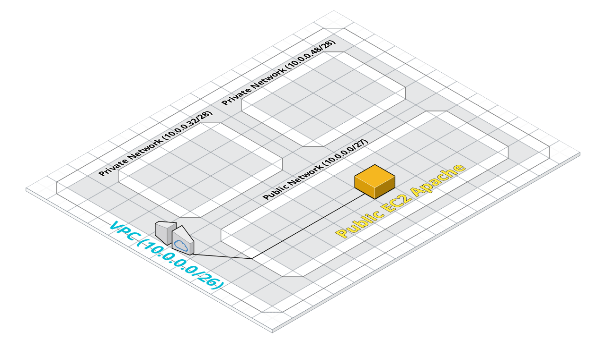

# terraform-aws-networking-exercises



The following is a small example of how to create a small, but basic network within AWS.

It is used to explain some of the main networking concepts by using as little infrastructure as possible.

## The resources

1. A VPC (with internet gateway)
2. 3 Subnets (1 public, 2 private)
3. A basic EC2 machine
4. A security group with all egress traffic, and HTTP ingress

## Getting Started

Note: You will need both git and terraform commands installed. You will also need AWS access. The simplest way is to set an environment variable with your ```AWS_ACCESS_KEY_ID``` and ```AWS_SECRET_ACCESS_KEY```. The AWS credentials need to be assigned permissions to create the resources.

* ```git clone https://github.com/loujaybee/terraform-aws-networking-exercises```
* `terraform init`
* `terraform apply` — Create the infrastructure

Disclaimer: This repository is purely for training purposes. I am not responsible for any costs, or damages caused by the running of the above commands and/or cloud resources. The resources created are entirely the responsibility of the creator and I am in no way responsible for any issues that arise from creating them.
